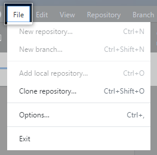
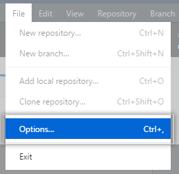
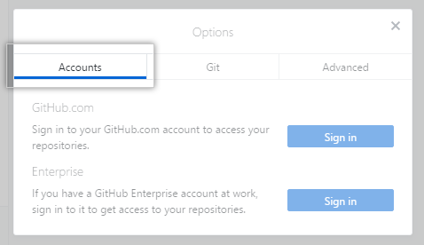

GitHub桌面版简介
===============

安装须知
-------
下载地址：https://desktop.github.com/
要求系统必须为Microsoft Windows 7或更高，64位处理器。

登录验证
-------
1. 安装完成后运行程序，点击窗口左上角的File
   |authen1|
#. 点击Options
   |authen2|
#. 在新弹出的窗口中点击Accounts
   |authen3|
#. 在Account对话框中，点击GitHub.com右边的Sign in
   |authen4|
#. 登录成功，可以进行后续的操作

:author:
        李涛

:date:
        2018年4月23日

